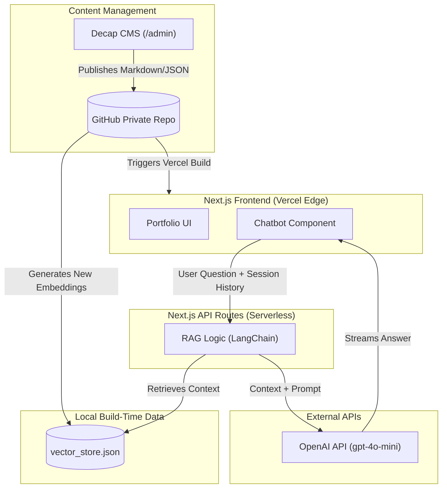

# Premium AI Portfolio & Personal Brand

A startup-quality, minimalist, and highly interactive personal portfolio built for speed, SEO, and AI demonstration. Designed with a premium dark aesthetic inspired by Apple, Linear, and OpenAI.

## 🎯 The Vision
"Building intelligent systems that solve real-world problems."

This is not a generic student portfolio. It is designed to feel like the homepage of an AI founder. It immediately answers three questions: Who are you? What have you built? Why should someone work with you? 

It features a built-in AI Assistant ("Talk to My AI") that uses Retrieval-Augmented Generation (RAG) to answer questions based strictly on the portfolio's context, proving AI engineering skills instantly.

---

## 🧰 Tech Stack Summary
- **Frontend Framework:** Next.js (App Router), React, TypeScript
- **Styling:** Tailwind CSS, Framer Motion
- **AI Integration:** LangChain, OpenAI API (`gpt-4o-mini`)
- **Database/Storage:** Local Build-Time JSON (Zero-cost Vector Store)
- **CMS (Content Management):** Decap CMS (Headless, Git-based)
- **Deployment:** Vercel (Edge Functions & Static Hosting)

---

## 🏗️ Architecture & Tech Stack

We designed a **"Zero-Cost, Serverless Edge"** architecture. This ensures the website is blazing fast globally (no server cold-starts) and costs $0/month to host, while still delivering complex AI features.

### Visual System Architecture

### 1. Frontend & Backend: Next.js (App Router)
- **Why we chose it:** Next.js provides Static Site Generation (SSG) for instant page loads and excellent SEO. More importantly, it provides **Serverless API Routes**. We can run our LangChain AI backend directly on Vercel's Edge network, eliminating the need for a separate Python backend that goes to sleep and suffers from 50-second cold starts.
- **Language:** TypeScript for type safety.
- **Deployment:** Vercel (Hobby Tier - $0/month).

### 2. Styling: Tailwind CSS + Framer Motion
- **Why we chose it:** Tailwind allows for rapid, consistent styling perfect for building a custom design system. Framer Motion is used for subtle micro-interactions (glassmorphism, smooth page transitions, sticky navbars) without resorting to cheap, bloated animations like "matrix rain."
- **Theme:** Minimal, Dark, Premium.

### 3. The "Database" (Vector Store): Build-Time JSON
- **Why we chose it:** To avoid paying for a 24/7 Vector Database (like Supabase or Pinecone) and to avoid network latency.
- **How it works:** During the Vercel build process, a script reads all portfolio content, fetches embeddings from OpenAI, and saves them to a local `vector_store.json` file. When the AI Assistant is queried, the Serverless Function loads this JSON into memory instantly and calculates cosine similarity in milliseconds. 
- **Cost:** $0/month.

### 4. CMS (Content Management System): Decap CMS
- **Why we chose it:** To provide a beautiful, free Admin Dashboard without needing a live database.
- **How it works:** Decap CMS provides a UI at `/admin`. When you write a new blog post or update an experience and click "Publish", the CMS uses the GitHub API to automatically commit a Markdown/JSON file to the repository. This triggers a Vercel rebuild, which updates the vector embeddings and the live site seamlessly.
- **Admin Security (Strictly Blocked):** The `/admin` route is secured via GitHub OAuth. If a random visitor tries to log in, they will be blocked because they do not have "Write" permissions to your private GitHub repository. **Only you** can access the dashboard.
- **Cost:** $0/month.

### 5. AI Engine: OpenAI API + RAG
- **Why we chose it:** `gpt-4o-mini` provides the perfect balance of extremely low cost (pennies per month) and high intelligence. The RAG pipeline ensures the AI only answers questions using the provided context (Resume, Projects, Blogs).
- **Session Memory:** The AI maintains a conversation history *only for the duration of the user's active session*. This allows for natural follow-up questions without permanently storing or tracking visitor chat logs.

---

## 🎨 Design System & Features

- **Hero Section:** High-impact typography, subtle animated background (mesh/grid), and clear call-to-actions.
- **Featured Projects:** Formatted like startup landing pages. Large screenshots, architecture diagrams, tech stacks, and live metrics.
- **Interactive Experience Timeline:** A beautiful vertical timeline for education, hackathons, and achievements.
- **Live GitHub Stats:** Real-time contribution graphs and pinned repositories to prove coding consistency.
- **Command Palette:** (Ctrl+K) for premium, keyboard-first navigation.
- **Blog:** Professional technical articles to showcase thought leadership.

---

## 🚀 Cost Breakdown

| Infrastructure | Service | Monthly Cost |
| :--- | :--- | :--- |
| **Hosting & API** | Vercel (Hobby) | $0.00 |
| **Database** | Build-Time JSON | $0.00 |
| **CMS** | Decap CMS + GitHub | $0.00 |
| **AI Inference** | OpenAI API | ~$0.50 (Usage Based) |
| **Total** | | **<$1.00 / month** |

---

## 🛠️ Local Development

*(Commands will be added here once the project is initialized)*
