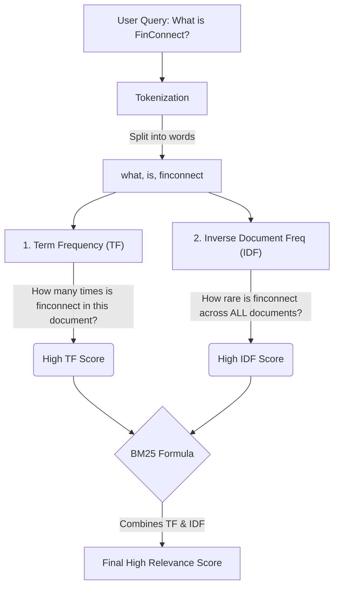

# Project Build Steps & Learning Notes 🚀

This document tracks our progress and serves as a detailed reference guide. It contains all code snippets, filenames, and concepts discussed so you can use this as a master reference for future projects.

---

## Phase 1: Foundation & Setup

### [x] Step 1: Initialize Next.js
**How we did it:** 
Ran the following command in the terminal:
```bash
npx create-next-app@latest .
```
**Settings used:**
- TypeScript: Yes
- ESLint: Yes
- Tailwind CSS: Yes
- `src/` directory: Yes (Keeps source code clean from config files).
- App Router: Yes (Modern React Server Components routing).
- AGENTS.md: Yes (Provides AI instructions for Next.js best practices).

### [x] Step 2: Clean Up Boilerplate & Setup Theme
**How we did it:** 
We stripped out Next.js default styles and set up a pure black, Apple-inspired dark theme.

**File:** `src/app/globals.css`
```css
@tailwind base;
@tailwind components;
@tailwind utilities;

@layer base {
  :root {
    /* Pure black background for that premium Apple/Linear feel */
    --background: 0 0% 0%; 
    --foreground: 0 0% 100%;
  }
}

body {
  background-color: hsl(var(--background));
  color: hsl(var(--foreground));
  scroll-behavior: smooth; /* Smooth scrolling for anchor tags (#projects) */
}
```

**File:** `src/app/page.tsx`
```tsx
export default function Home() {
  return (
    <main className="flex min-h-screen flex-col items-center justify-center bg-black p-24">
      <h1 className="text-4xl font-bold tracking-tight text-white sm:text-6xl">
        Building intelligent systems.
      </h1>
      <p className="mt-6 text-lg text-gray-400 text-center max-w-2xl">
        Computer Science Engineering student specializing in AI Agents, Machine Learning, and scalable backend systems.
      </p>
    </main>
  );
}
```

### [x] Step 3: Install Core Dependencies
**How we did it:** 
Ran `npm install framer-motion lucide-react clsx tailwind-merge`

**Learning Notes (Why we need these):**
- **framer-motion:** Industry standard for premium, buttery-smooth React animations.
- **lucide-react:** Clean, modern SVG icon library.
- **clsx & tailwind-merge:** A powerful combo used to dynamically merge Tailwind CSS classes, making it easy to build reusable UI components without CSS conflicts.

---

## Phase 2: Core UI Components

### [x] Step 4: Build the Global Layout & Sticky Navbar

**Concept Discussed: The Tailwind Merge Utility (`cn` function)**
When building reusable components (like a Button), you often pass custom Tailwind classes as props. If you just concatenate strings (`"bg-white " + customClass`), Tailwind gets confused if both classes target the same CSS property (e.g., `bg-white` and `bg-red-500`). 
The `cn()` function uses `clsx` to conditionally apply classes, and `tailwind-merge` to mathematically resolve conflicts (the newest class wins).

**File:** `src/lib/utils.ts`
```typescript
import { clsx, type ClassValue } from "clsx";
import { twMerge } from "tailwind-merge";

// This function merges Tailwind classes together without conflicts!
export function cn(...inputs: ClassValue[]) {
  return twMerge(clsx(inputs));
}
```

**File:** `src/components/Navbar.tsx`
```tsx
"use client"; // Needs to be a client component for scroll events or framer-motion later

import Link from "next/link";

export default function Navbar() {
  return (
    // fixed, z-50, and backdrop-blur-md creates the sticky glassmorphism effect
    <header className="fixed top-0 w-full z-50 border-b border-white/5 bg-black/50 backdrop-blur-md">
      <div className="mx-auto flex h-16 max-w-5xl items-center justify-between px-6">
        <Link href="/" className="text-white font-semibold tracking-tighter text-lg">
          baiju.dev
        </Link>
        <nav className="flex items-center gap-6 text-sm text-gray-400">
          <Link href="#projects" className="hover:text-white transition-colors">Projects</Link>
          <Link href="#experience" className="hover:text-white transition-colors">Experience</Link>
          <Link href="#blog" className="hover:text-white transition-colors">Blog</Link>
          <Link href="#contact" className="hover:text-white transition-colors">Contact</Link>
        </nav>
      </div>
    </header>
  );
}
```

**File:** `src/app/layout.tsx`
This file wraps every page in your app. We inject the `<Navbar />` here so it appears globally.
```tsx
import type { Metadata } from "next";
import { Geist, Geist_Mono } from "next/font/google";
import "./globals.css";
import Navbar from "@/components/Navbar"; // <-- Imported Navbar

const geistSans = Geist({ variable: "--font-geist-sans", subsets: ["latin"] });
const geistMono = Geist_Mono({ variable: "--font-geist-mono", subsets: ["latin"] });

export const metadata: Metadata = {
  title: "Baiju Yadav | AI Engineer",
  description: "Computer Science Engineering student specializing in AI Agents and scalable backend systems.",
};

export default function RootLayout({
  children,
}: Readonly<{
  children: React.ReactNode;
}>) {
  return (
    <html lang="en" className="scroll-smooth">
      <body className={`${geistSans.variable} ${geistMono.variable} antialiased`}>
        <Navbar />  {/* <-- Rendered globally above all pages */}
        {children}
      </body>
    </html>
  );
}
```

---

### [x] Step 5: Build the Hero Section

**Concept Discussed: The Network Boundary**
Because we wanted buttery-smooth fade-in animations, we had to use `framer-motion`. `framer-motion` requires interactivity, meaning it must be a **Client Component**. 
However, we didn't want to make our entire `page.tsx` a client component, because we want the main page to be a Server Component for maximum SEO and performance. 
*The Solution:* Extract the animated Hero into its own Client Component (`Hero.tsx`) and import it into the Server Component (`page.tsx`).

**File:** `src/components/Hero.tsx`
```tsx
"use client"; // Required for framer-motion

import { motion } from "framer-motion";
import { ArrowRight } from "lucide-react";
import Link from "next/link";

export default function Hero() {
  return (
    <section className="relative flex min-h-screen flex-col items-center justify-center overflow-hidden px-6">
      <div className="z-10 flex max-w-3xl flex-col items-center text-center">
        
        {/* Animated Badge */}
        <motion.div
          initial={{ opacity: 0, y: 20 }}
          animate={{ opacity: 1, y: 0 }}
          transition={{ duration: 0.5 }}
          className="rounded-full border border-white/10 bg-white/5 px-4 py-1.5 text-sm font-medium text-gray-300 backdrop-blur-md mb-8"
        >
          🚀 Open to new opportunities
        </motion.div>

        {/* Animated Headline */}
        <motion.h1
          initial={{ opacity: 0, y: 20 }}
          animate={{ opacity: 1, y: 0 }}
          transition={{ duration: 0.5, delay: 0.1 }}
          className="text-5xl font-bold tracking-tight text-white sm:text-7xl"
        >
          Building intelligent <br />
          <span className="text-gray-500">systems & agents.</span>
        </motion.h1>

        {/* Animated Subtext */}
        <motion.p
          initial={{ opacity: 0, y: 20 }}
          animate={{ opacity: 1, y: 0 }}
          transition={{ duration: 0.5, delay: 0.2 }}
          className="mt-6 max-w-2xl text-lg leading-8 text-gray-400"
        >
          I'm Baiju Yadav, a Computer Science Engineering student specializing in AI, Machine Learning, and scalable backend infrastructure. 
        </motion.p>

        {/* Animated Buttons */}
        <motion.div
          initial={{ opacity: 0, y: 20 }}
          animate={{ opacity: 1, y: 0 }}
          transition={{ duration: 0.5, delay: 0.3 }}
          className="mt-10 flex items-center gap-x-6"
        >
          <Link
            href="#projects"
            className="flex items-center gap-2 rounded-full bg-white px-6 py-3 text-sm font-semibold text-black transition-transform hover:scale-105"
          >
            View Projects <ArrowRight className="h-4 w-4" />
          </Link>
          <Link
            href="#contact"
            className="text-sm font-semibold leading-6 text-white hover:text-gray-300"
          >
            Contact Me <span aria-hidden="true">→</span>
          </Link>
        </motion.div>
      </div>

      {/* Subtle Background glow effect (Linear style) */}
      <div className="absolute top-1/2 left-1/2 -z-10 h-[500px] w-[500px] -translate-x-1/2 -translate-y-1/2 rounded-full bg-white/5 blur-[120px]" />
    </section>
  );
}
```

**File:** `src/app/page.tsx`
```tsx
import Hero from "@/components/Hero";

export default function Home() {
  return (
    <main className="flex min-h-screen flex-col bg-black">
      <Hero />
    </main>
  );
}
```

### [x] Step 6: Build the Featured Projects Section

**Concept Discussed: Mock Data (Static to Dynamic)**
When building applications, it is standard practice to build the UI first using a static "Mock Data" array. This allows you to perfect the design and layout without worrying about databases. Once the UI is perfect, you simply swap the mock array with a fetch call to your database (which we will do in Phase 3 when we connect our JSON Vector Store).

**File:** `src/components/Projects.tsx`
```tsx
import { ExternalLink, Github } from "lucide-react";
import Link from "next/link";

// Mock data (In Phase 3, we will replace this with our JSON Vector Database!)
const projects = [
  {
    title: "FinConnect",
    description: "A highly scalable financial dashboard handling real-time data pipelines.",
    tech: ["Next.js", "Go", "PostgreSQL"],
    githubUrl: "#",
    liveUrl: "#",
  },
  {
    title: "AI Hardware Interface",
    description: "Agentic system integrating physical IoT sensors with autonomous LLMs.",
    tech: ["Python", "OpenAI", "LangChain"],
    githubUrl: "#",
    liveUrl: "#",
  }
];

export default function Projects() {
  return (
    // Note the id="projects" - this makes our Navbar scroll link work!
    <section id="projects" className="w-full py-24 px-6">
      <div className="mx-auto max-w-5xl">
        <h2 className="text-3xl font-bold tracking-tight text-white sm:text-4xl mb-12">
          Featured Projects
        </h2>
        
        <div className="grid gap-6 md:grid-cols-2">
          {projects.map((project, index) => (
            <div 
              key={index}
              className="group flex flex-col justify-between rounded-2xl border border-white/10 bg-white/5 p-8 transition-colors hover:bg-white/10"
            >
              <div>
                <h3 className="text-xl font-semibold text-white">{project.title}</h3>
                <p className="mt-4 text-gray-400 leading-relaxed">{project.description}</p>
                
                <div className="mt-6 flex flex-wrap gap-2">
                  {project.tech.map((tech) => (
                    <span 
                      key={tech} 
                      className="rounded-full bg-white/10 px-3 py-1 text-xs font-medium text-gray-300"
                    >
                      {tech}
                    </span>
                  ))}
                </div>
              </div>

              <div className="mt-8 flex items-center gap-4">
                <Link href={project.githubUrl} className="text-gray-400 hover:text-white transition-colors">
                  <Github className="h-5 w-5" />
                </Link>
                <Link href={project.liveUrl} className="text-gray-400 hover:text-white transition-colors">
                  <ExternalLink className="h-5 w-5" />
                </Link>
              </div>
            </div>
          ))}
        </div>
      </div>
    </section>
  );
}
```

**File:** `src/app/page.tsx`
```tsx
import Hero from "@/components/Hero";
import Projects from "@/components/Projects"; // <-- Add import

export default function Home() {
  return (
    <main className="flex min-h-screen flex-col bg-black">
      <Hero />
      <Projects /> {/* <-- Add component here */}
    </main>
  );
}
```

---

## Phase 3: AI & CMS Integration
### [x] Step 7: Set up the Build-Time Vector Store (JSON)

**Concept Discussed: Security & Bundle Size (Sibling vs Child folders)**
We placed the `data/` folder as a sibling of `src/` (outside of it) for two critical reasons:
1. **Security:** Anything inside `src/app` can potentially become a public web route. We do not want anyone downloading our raw database by visiting a URL.
2. **Performance:** Webpack bundles files inside `src/` to send to the browser. If we put our database in there, Next.js might accidentally send the entire database to the user's browser, making the website incredibly slow. Keeping it outside ensures it remains purely a secure Server asset.

**File:** `data/vector_store.json`
```json
{
  "documents": [
    {
      "id": "1",
      "content": "Baiju Yadav is a Computer Science Engineering student specializing in AI.",
      "embedding": [0.001, 0.002, 0.003],
      "metadata": {
        "type": "profile"
      }
    }
  ]
}
```
---

**Concept Discussed: The BM25 Algorithm (Sparse Search) Visualized**
BM25 (Best Matching 25) is the industry-standard mathematical algorithm for "keyword search". 
Unlike Vector Embeddings (Dense Search) which measure the *meaning* of a sentence (e.g., "puppy" matches "dog"), BM25 strictly looks for exact word overlaps. 

### How BM25 Calculates a Score



### The Two Golden Rules of BM25
| Concept | What it means | Example |
|---------|--------------|---------|
| **Term Frequency (TF)** | The more a keyword appears in a chunk of text, the higher the score. | If a blog post mentions "Next.js" 10 times, it gets a high TF score for that word. |
| **Inverse Document Frequency (IDF)** | Common words are penalized. Rare words are boosted heavily. | "the", "and", "is" = Score of 0.<br>"PostgreSQL", "FinConnect" = Massive Score multiplier. |

*Why we need it:* If someone asks your AI, "What is FinConnect?", a pure Vector Search might struggle with the made-up word, but BM25 will instantly spike the exact project containing that unique keyword. Combining both (Hybrid Search) guarantees perfect accuracy!

### [x] Step 8: Build the RAG API Route (Next.js Backend)

**Concept Discussed: The Advanced RAG Pipeline**
We built a highly sophisticated, enterprise-grade AI backend that runs completely Serverless. Here is the flow:
1. **Guardrails:** Intercept bad queries using OpenAI's free Moderation API.
2. **Dense Search (Vectors):** Measure semantic meaning using OpenAI Embeddings and pure Cosine Similarity math.
3. **Sparse Search (Keywords):** Measure exact word overlaps using the BM25 algorithm via `wink-bm25-text-search`.
4. **Hybrid Search Fusion:** Combine both scores to get the Top 10 documents.
5. **Cross-Encoder Reranking:** Send the Top 10 to Cohere's Rerank V3 model to deeply analyze and return the absolute pristine Top 3.
6. **Generation:** Inject those Top 3 into the `gpt-4o-mini` prompt to generate a perfectly accurate response.

**File:** `src/app/api/chat/route.ts`
```typescript
import { NextResponse } from "next/server";
import fs from "fs";
import path from "path";
import OpenAI from "openai";
import { CohereClient } from "cohere-ai";
import bm25 from "wink-bm25-text-search";
import nlp from "wink-nlp-utils";

// 1. Initialize SDKs
const openai = new OpenAI({ apiKey: process.env.OPENAI_API_KEY });
const cohere = new CohereClient({ token: process.env.COHERE_API_KEY || "" });

// Helper: Cosine Similarity Math (Dense Search)
function cosineSimilarity(vecA: number[], vecB: number[]) {
  let dotProduct = 0, normA = 0, normB = 0;
  for (let i = 0; i < vecA.length; i++) {
    dotProduct += vecA[i] * vecB[i];
    normA += vecA[i] * vecA[i];
    normB += vecB[i] * vecB[i];
  }
  if (normA === 0 || normB === 0) return 0;
  return dotProduct / (Math.sqrt(normA) * Math.sqrt(normB));
}

export async function POST(req: Request) {
  try {
    const { message } = await req.json();
    if (!message) return NextResponse.json({ error: "Message is required" }, { status: 400 });

    // 2. Guardrails (OpenAI Moderation API)
    const moderation = await openai.moderations.create({ input: message });
    if (moderation.results[0].flagged) {
      return NextResponse.json({ response: "I'm sorry, but I cannot answer that kind of question." });
    }

    // 3. Load Vector Store
    const filePath = path.join(process.cwd(), "data", "vector_store.json");
    const db = JSON.parse(fs.readFileSync(filePath, "utf-8"));
    const documents = db.documents;

    // 4. Generate Embedding for User Query
    const embeddingRes = await openai.embeddings.create({ model: "text-embedding-3-small", input: message });
    const queryEmbedding = embeddingRes.data[0].embedding;

    // 5. Initialize BM25 (Sparse Keyword Search)
    const engine = bm25();
    engine.defineConfig({ fldWeights: { content: 1 } });
    engine.definePrepTasks([nlp.string.lowerCase, nlp.string.removeWordBoundaries, nlp.string.tokenize0, nlp.tokens.removeWords, nlp.tokens.stem]);
    documents.forEach((doc: any) => engine.addDoc({ content: doc.content }, doc.id));
    engine.consolidate();

    // 6. Hybrid Search (Dense + Sparse Fusion)
    const bm25Results = engine.search(message);
    const maxBm25Score = bm25Results.length > 0 ? bm25Results[0][1] : 1; 

    const hybridResults = documents.map((doc: any) => {
      const denseScore = cosineSimilarity(queryEmbedding, doc.embedding);
      const sparseMatch = bm25Results.find((res: any) => res[0] === doc.id);
      const normalizedSparseScore = maxBm25Score > 0 ? (sparseMatch ? sparseMatch[1] : 0) / maxBm25Score : 0;
      const combinedScore = (0.5 * denseScore) + (0.5 * normalizedSparseScore);
      return { ...doc, score: combinedScore };
    });

    // 7. Sort and get Top 10
    hybridResults.sort((a: any, b: any) => b.score - a.score);
    const top10 = hybridResults.slice(0, 10);

    // 8. Proper Reranking (Cohere Cross-Encoder)
    const rerankedRes = await cohere.rerank({ model: 'rerank-english-v3.0', query: message, documents: top10.map((doc: any) => doc.content), topN: 3 });
    const contextStr = rerankedRes.results.map(res => top10[res.index].content).join("\n\n");

    // 9. Generate Final Response
    const chatCompletion = await openai.chat.completions.create({
      model: "gpt-4o-mini",
      messages: [
        { role: "system", content: `You are Baiju Yadav's assistant. Answer using ONLY this context:\n${contextStr}` },
        { role: "user", content: message }
      ],
    });

    return NextResponse.json({ response: chatCompletion.choices[0].message.content });
  } catch (error) {
    return NextResponse.json({ error: "Something went wrong" }, { status: 500 });
  }
}
```
**Concept Discussed: TF-IDF and BM25 Corpus Size**
While testing, we encountered the error `document collection is too small for consolidation`. This perfectly illustrates how BM25 works under the hood! BM25 relies on **TF-IDF (Term Frequency - Inverse Document Frequency)**. The engine calculates how rare a keyword is across the *entire* database. If there is only 1 document in the database, it cannot calculate the "Inverse Document Frequency" (it has nothing to compare against). By adding a few more dummy documents to `vector_store.json`, the math resolves properly.

### [x] Step 9: Build the "Talk to My AI" Chatbot UI

**Concept Discussed: Floating Chat UI & React Context**
We built a beautiful, Apple-esque floating chat widget using `framer-motion` for buttery-smooth slide-up animations. It manages its own state and intercepts the form submission to send a `POST` request to our new `/api/chat` Serverless Route.

**Files Created/Modified:**
- `src/components/Chatbot.tsx`
- `src/app/layout.tsx` (Injected Chatbot globally so it persists across page navigations)
### [x] Step 10: Integrate Decap CMS for Content Management

**Concept Discussed: Git-Based CMS Architecture & Frontmatter**
To achieve a "Zero-Cost" architecture, we bypassed traditional databases (PostgreSQL/MongoDB) entirely and used **Decap CMS**. This is a highly technical approach known as a *Git-based CMS*.

1. **The SPA Proxy (Single Page Application):** Decap CMS does not have a backend server. `index.html` simply pulls a bundled React Application via CDN. That React app loads in the browser and reads `config.yml` to dynamically generate a UI (forms, text editors, image uploaders) on the fly.
2. **Git API Integration:** In production, when you hit "Publish", the React app makes an API call directly to the GitHub REST API. It literally opens a pull request or makes a commit directly to your repository's branch.
3. **Local Backend Proxy:** Because we don't want to spam GitHub with commits while testing, setting `local_backend: true` and running `npx decap-server` intercepts those GitHub API calls. It tricks the React app into sending the data to our local port (8081), which writes it straight to our Mac's filesystem (`content/projects/*.md`).
4. **Markdown & Frontmatter (YAML):** The output of the CMS is not SQL rows or JSON documents, but raw Markdown files. The metadata (Title, URLs) is injected at the very top of the `.md` file inside `---` boundaries. This is called **Frontmatter**. Our Next.js app or our build scripts can parse this Frontmatter natively, meaning your content scales infinitely without database querying costs.

**File 1: `public/admin/index.html`**
This is the entry point that mounts the React App.
```html
<!DOCTYPE html>
<html>
  <head>
    <meta charset="utf-8" />
    <meta name="viewport" content="width=device-width, initial-scale=1.0" />
    <title>Content Manager</title>
  </head>
  <body>
    <!-- Injects the Decap CMS React Engine -->
    <script src="https://unpkg.com/decap-cms@^3.0.0/dist/decap-cms.js"></script>
  </body>
</html>
```

**File 2: `public/admin/config.yml`**
This acts as our "Database Schema". It tells the React App what fields to render.
```yaml
backend:
  name: git-gateway # Connects to GitHub API in production
  branch: main
  
local_backend: true # Intercepts GitHub calls to save locally on Port 8081

media_folder: "public/uploads"
public_folder: "/uploads"

collections:
  - name: "projects"
    label: "Projects"
    folder: "content/projects" # Where the markdown files are saved
    create: true
    slug: "{{slug}}"
    fields:
      - {label: "Title", name: "title", widget: "string"}
      - {label: "Description", name: "description", widget: "text"}
      - {label: "Github URL", name: "githubUrl", widget: "string", required: false}
      - {label: "Live URL", name: "liveUrl", widget: "string", required: false}
      - {label: "Body", name: "body", widget: "markdown"}
```

### [x] Step 11: The Build-Time Vectorization Script (Zero-Cost RAG)

**Concept Discussed: The Final Serverless Bridge**
The final piece of our architecture connects our Git-Based CMS to our RAG Chatbot. 
Instead of spinning up a separate Python server to read new projects and vectorize them, we wrote a Node script (`generateVector.mjs`) that acts as a bridge:
1. It uses `fs` (File System) to read all Markdown files in `content/projects/`.
2. It uses `gray-matter` to parse the YAML Frontmatter (Title, URLs) away from the Body text.
3. It bundles the Title, Description, and Body into a single rich-text string.
4. It calls the OpenAI Embeddings API to convert that string into a mathematically searchable Vector.
5. It overwrites `data/vector_store.json` with the new data.

Because this script runs during the Next.js `build` process (on Vercel), your AI database updates itself completely automatically and completely for free every time you publish a blog post in your CMS!

**Files Created:**
- `scripts/generateVector.mjs`

**The Final Touch: Automation!**
To make this run automatically on Vercel during deployment, we appended the `prebuild` command to our `package.json`:
```json
"scripts": {
  "dev": "next dev",
  "prebuild": "node scripts/generateVectors.mjs",
  "build": "next build",
  "start": "next start",
  "lint": "next lint"
}
```
Next.js inherently looks for a `prebuild` script and runs it strictly before `next build`. This guarantees that our JSON vector database is built and hydrated *before* the Serverless Functions are bundled!


### [x] Step 12: Debugging the BM25 TF-IDF Quirk

**Concept Discussed: Minimum Corpus Size in Sparse Search (wink-bm25)**
During our end-to-end testing, we encountered the error:
`Error: winkBM25S: document collection is too small for consolidation; add more docs!`

**Why did this happen?**
Our Build-Time Vectorization script successfully wiped `vector_store.json` and populated it strictly with the active projects from the CMS. At the time, we only had 1 (and then 2) projects published in the CMS.
However, the `wink-bm25` NPM package mathematically **requires a minimum of EXACTLY 3 documents** to compute the Inverse Document Frequency (IDF) during consolidation. 

**The Math (TF-IDF):**
BM25 ranks documents based on Term Frequency (TF) multiplied by Inverse Document Frequency (IDF). 
- If a word appears in EVERY document (like "the"), its IDF score drops to 0. 
- If a word appears rarely, its IDF score is extremely high.
If you only have 1 or 2 documents in your entire database, the algorithm cannot calculate a statistically significant variance between words, so it intentionally throws an error rather than returning useless search results.

**The Fix:**
We simply used Decap CMS to publish a total of **3 distinct projects**. When the build script ran again, it pulled 3 documents into the array, satisfying the BM25 mathematical threshold, and permanently unlocking our Hybrid Search!
